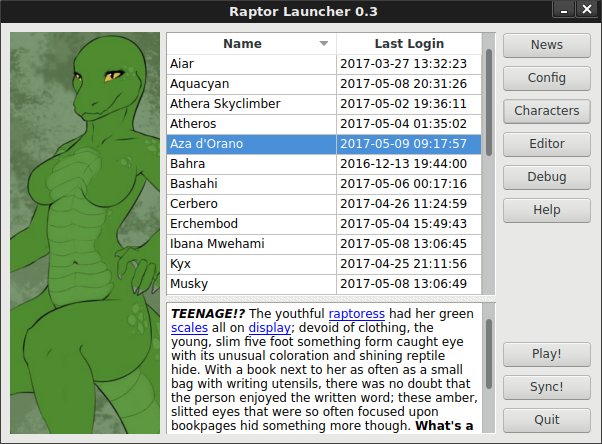
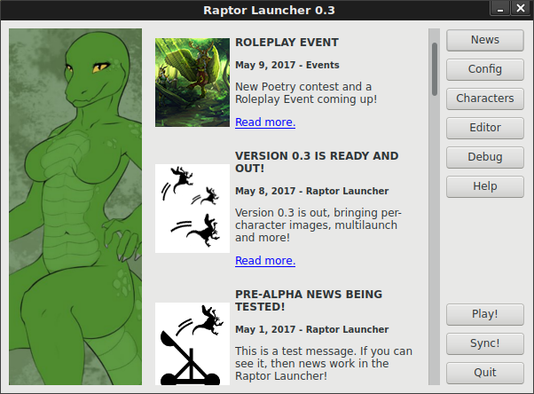

# Raptor Launcher
A variant launcher for Furcadia written in Common Lisp and CommonQt/Qt4.

## Scope
  * Show arbitrary images when a given character is selected. **(DONE)**
  * Display characters from different mail accounts on a single list. **(DONE)**
  * Launch multiple characters at once. **(DONE)**
  * Display news from Furcadia and Raptor Launcher newsfeeds. **(DONE)**
  * Edit descriptions and other attributes as pure text.
  * Edit descriptions and other attributes with a graphical preview.
  * Backup and restore character information to/from human-readable files.
  * Import legacy INI files for creating costumes.
  * Bulk-set details for all characters, such as AFK information.
  * Automatically refresh characters to prevent them from expiration.
  * Integrate the launcher with Pounce.
  * Launch Furcadia directly from command line for any given character.

## Screenshots

## Dependencies
All dependencies are available on Quicklisp.

See the `furcadia-launcher.asd` file for full information.

## Furcadia-side improvements
  * A means of fetching full information for all characters of a given account at once.
  * A means of saving full information for all characters of a given account at once.
  * A means of fetching `furc://` login links without sending full character information to the server.

## Summary of the current technique
  1. **Login into Furcadia CMS.**
     1. GET the login page.
     2. Extract the authentication secret from HTML.
     3. POST the login which includes the authentication secret.
  2. **Get the login string.**
     1. GET the FurEd page.
     2. Extract the character login secret from HTML.
     3. Fetch the character we want to login as.
     4. POST the character with the character login secret.
     5. Receive the `furc://` login string from the HTTP response.
  3. **Launch Furcadia.**
     1. Construct the Furcadia launch command, depending on the running OS.
     2. Launch the Furcadia client with the resulting command.
